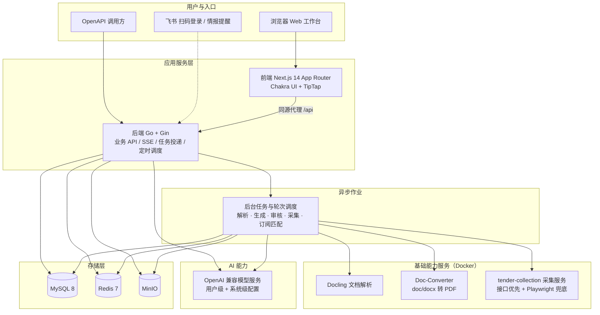

# 标擎 (BidEngine) — 招投标 AI 工作台

> 找标 · 读标 · 写标 · 审标 · 沉淀，一条链路打通

[](https://go.dev/)
[](https://nextjs.org/)
[](https://chakra-ui.com/)
[](https://redis.io/)
[](https://mysql.com/)
[](./LICENSE)

---

## 产品定位

标擎（BidEngine）是面向招投标行业的 AI 工作台，把原本割裂的工作串成一条闭环：

**发现机会 → 读懂文件 → 写出标书 → 守住合规 → 沉淀资产**

- **招标情报站**持续发现正在发布的招标公告，按订阅规则匹配并提醒
- **招标解析**把几十上百页的招标文件拆成可核验、可溯源的字段、条款与风险
- **投标文件生成**基于解析结果与素材库组装标书正文
- **投标文件审核**逐条对比招标要求与投标响应，并沉淀企业规则库
- **素材库**统一管理企业资质、业绩、模板与图片，供生成与审核复用

**核心价值**：把“找标”变成订阅与匹配，把“写标”变成组装与校验，让团队精力集中在差异化内容与关键合规点上。

---

## 功能地图

| 模块 | 入口 | 一句话 |
|---|---|---|
| 招标情报站 | `/intel` | 多源采集招标公告，订阅匹配 + 站内/飞书提醒 |
| 招标解析 V3 | `/bid-analysis` | 规范化 → 章节 → 字段 → 条款 → 风险/评分 → 蓝图 → 摘要 |
| 投标文件生成 | `/file-gen` | 大纲确认 + SSE 流式生成 + 在线编辑 + DOCX/PDF 导出 |
| 投标文件审核 | `/bid-audit` | 清单驱动差异审核、整改闭环、企业规则库、报告导出 |
| 素材库 | `/material` | 企业资质 / 业绩 / 模板 / 图片库，AI 打标与 OCR |
| 系统管理 | `/system` | 用户模型配置、系统模型配置、招标情报管理、公司与用户管理 |
| 个人工作台 | `/` | 跨模块统计、最近工作、待关注事项、模型配置状态 |
| 意见反馈 | `/file-feedback` | 提交问题与截图，跟踪处理状态 |

---

## 一、招标情报站

原有的解析、生成、审核都发生在“已经拿到招标文件”之后；情报站补上了前置链路，让用户不必人工翻十几个招标网站。

**采集服务（独立部署，端口 5011）**

- 四级取数策略：站内 API → 静态列表页 → Playwright 无头浏览器渲染 → 搜索 API 补长尾
- 正文用通用抽取（trafilatura 主、readability 兜底）；字段规则优先、LLM 兜底，正则只做校验，站点改版不会大面积失效
- 服务边界清晰：只把站点转成结构一致的公告文档，不连数据库、不持业务状态；落库、去重、打标、匹配全部在后端

**情报大厅**

- 关键词、地区、行业、金额、发布时间多条件筛选，列表与详情
- 收藏、AI 解读（这条公告值不值得投）
- 详情页可预填信息，一键发起招标解析

**订阅与提醒**

- 用自然语言描述关注条件，后端解析成结构化订阅规则
- 命中后生成站内提醒，顶部铃铛展示未读数；绑定飞书后同步推送

**采集运维与情报管理（仅超管）**

- 采集源管理：增删改、批量导入、导入模板下载、站点连通性与抽取样例探测
- 采集批次可观测：每轮运行明细、按源结果、失败重试、批次删除、手工触发
- 定时轮次配置；订阅匹配作业面（优先级、取消、重试、重扫）
- 情报管理：手工发布、批量导入、置顶、隐藏、下架、恢复、编辑、删除

**数据生命周期**：招标公告保留 180 天，原始 HTML 快照 30 天，到期由定时任务清理。

---

## 二、招标解析（V3）

上传 PDF / DOC / DOCX，异步流水线产出结构化解析结果。前端为“深海智能工作台”：状态轨、证据导航与核验详情三大区。

**流水线阶段**（可暂停、可跳阶段、失败可按阶段重跑）

```
文档规范化与全文索引 → 章节识别 → 字段提取（预定义 + 动态发现）
→ 条款抽取与解读 → 风险评估 / 评分预估 → 标书蓝图 → 智能摘要
```

**能力**

- **证据溯源**：字段与条款都带原文页码与坐标，点开即定位到 PDF 对应位置
- **多值字段与结构化表格**：同一字段的多个取值、跨页表格单独成表
- **告警与关注项**：可疑结果集中呈现，人工确认后消除；支持自定义关注点
- **标书蓝图**：AI 生成投标书大纲骨架，支持增删改、采纳或移除 AI 建议节点，确认后一键创建标书生成项目
- **智能摘要**：资格差距、关键风险、评分权重、关键日期一页看完
- **可控运行**：暂停 / 恢复 / 跳过阶段 / 失败阶段重跑 / 重新解析；前端 5 秒轮询阶段与百分比双维度进度

---

## 三、投标文件生成

基于招标解析结果 + 素材库内容，AI 辅助生成投标书正文。

**项目创建**：空白标书 / 从招标文件创建 / 从模板创建

**写作流程**

- 大纲确认：草稿 → 大纲评审 → 写作，支持节点增删改、层级与排序调整、按文档标题回同步大纲、撤销确认
- AI 生成：全文或单章 SSE 流式生成，可中断；支持对选中片段 AI 重写（不落库，确认后才写入）
- 素材联动：自动匹配企业资质、业绩与方案段落，并在正文标注引用来源
- 在线编辑：TipTap 富文本编辑，自动保存；人工标记章节写作完成状态

**导出**：DOCX / PDF，两遍导出回读章节页码，便于生成带页码的目录与溯源索引

---

## 四、投标文件审核

上传招标 + 投标文件（可关联已有的招标解析项目），或直接从标书生成项目发起审核。

**清单驱动流水线**

- 逐页 PDF 解析 + 分块检索 + LLM 差异识别，输出结构化审核清单
- 检查项支持人工确认 / 驳回与备注，支持单项复检与整批复检
- 整改闭环：记录整改状态与责任人

**企业规则库**

- 维护企业自己的审核规则；可把某条检查项一键沉淀为规则，后续审核自动复用

**其他**

- 暗标评审开关、审核任务取消、阶段断点重跑
- 溯源索引：差异项精确定位到 PDF 页码与坐标
- 审核报告导出：多 sheet Excel

---

## 五、素材库

企业素材的结构化管理与 AI 增强，供标书生成与审核复用。

- **企业资质** / **企业业绩** / **文档模板**：分类管理，支持附件上传、预览、下载与排序
- **图片库**：图片统一管理，支持上传、移动分组、排序、编辑与删除
- **AI 增强**：素材自动打标签、图片智能描述；OCR 解析结果可查看与重试
- **知识库**：单条素材的解析产物与知识沉淀页（产品库开发中）

---

## 六、系统管理与协作

- **模型配置**（`/system/llm-config`）：按业务模块分别配置 LLM 的 base_url / api_key / model / endpoint_path，列表脱敏展示，可逐模块测试连通性
- **系统模型配置**（`/system/llm-config/system`，超管）：平台级候选模型列表、排序与失败自动降级，供招标情报站等无用户上下文的后台任务使用
- **招标情报管理**（`/system/intel`，超管）：采集源、采集批次、订阅匹配、情报发布与批量导入
- **公司与用户管理**：公司信息与负责人、用户信息维护
- **飞书集成**：扫码登录、账号绑定、资料补充，招标情报订阅提醒推送到飞书
- **意见反馈**：用户提交反馈类型、描述与截图，管理员更新处理状态
- **开放接口**：`/openapi` 通道使用独立令牌鉴权，未配置令牌时默认关闭

---

## 技术架构



### 技术选型

| 层级 | 技术 |
|------|------|
| 前端框架 | Next.js 14 (App Router) + TypeScript |
| UI 组件库 | Chakra UI v2.8 |
| 富文本编辑器 | TipTap v3 (ProseMirror) |
| 后端语言 | Go ≥ 1.23 |
| HTTP 框架 | Gin v1.9 |
| ORM | GORM v1.24 + gorm.io/gen 代码生成 |
| 数据库 | MySQL 8.0 |
| 任务队列 / 进度事件 | Redis 7 |
| 对象存储 | MinIO（本地部署，无三方 OSS 依赖） |
| 文档解析 | Docling (docling-serve v1.16.1) |
| 文档转换 | doc-converter（doc/docx 转 PDF） |
| 招标公告采集 | tender-collection（Python + FastAPI + Playwright + trafilatura） |
| 认证 | JWT（Cookie `bid-engine-authorization`）、飞书扫码登录、IAM 回调 |
| LLM | OpenAI 兼容 API，用户级 `user_llm_config` + 系统级 `system_llm_config` |

---

## 快速开始

### 环境

- Go ≥ 1.23 / Node.js ≥ 22 / Docker Desktop
- MySQL 8.0（本地默认 root:root，库 `smart-bid`）
- Redis 7 + MinIO + Docling + Doc-Converter + 采集服务（Docker 容器，通过 `docker compose` 管理）

### 环境相关配置（可选覆盖）

仓库里的 `bid-engine-backend/conf/conf-local.yml`、`conf-container.yml` 只包含通用默认值，
不含内网地址、自定义域名等服务端私有信息。部署时按需创建同目录下的覆盖文件，加载时自动深合并（覆盖优先）：

| 主配置 | 覆盖文件 |
|---|---|
| `conf-local.yml` | `conf-local.override.yml` |
| `conf-container.yml`（容器内为 `conf.yml`） | `conf-container.override.yml`（容器内为 `conf.override.yml`） |

覆盖文件已在 `.gitignore` 中，不会随仓库分发；也可以直接用环境变量
`BID_ENGINE_CONF_OVERRIDE_FILE` 指定其他路径。典型内容：

```yaml
properties:
  cors_allowed_domains: example.com      # 允许的跨域来源后缀，逗号分隔；留空表示只允许本地联调
  pdf_base_url: http://127.0.0.1:5001    # 私有 PDF 服务地址（可选，未部署时相关能力不可用）
  pdf_app_id: your_app_id
  pdf_app_secret: your_app_secret
```

容器模式请同时保留 `docker-compose-backend.yaml` 中的覆盖文件挂载（文件不存在时自动忽略）。

### 一键启动

```bash
bash start.sh
```

**自动执行：** 环境预检（只读检查 Go / Node / MySQL 可达性、基础容器运行状态）→ 释放宿主机 3000 / 1022 端口 → 配置前端环境变量 → 启动 Go 后端(1022) → 启动 Next.js 前端(3000) → 打开浏览器。脚本**不管理任何容器**（Redis / MinIO / Docling / Doc-Converter / 采集服务仅检查并提醒，需自行用 `docker compose up -d` 维护）。

| 特性 | 说明 |
|------|------|
| 运行环境 | Bash（macOS / Windows Git Bash / WSL） |
| 依赖要求 | MySQL + Go + Node.js（基础容器需自行运行） |
| 进程管理 | 统一进程组，`Ctrl+C` 停止前后端（Docker 容器保持运行） |
| 自动清理 | 启动前 kill 占用 1022/3000 端口的旧进程 |
| 环境注入 | 自动写入 `.env.development.local` 指向本地后端 |
| 容器策略 | 不启动/停止/重建任何容器；仅检查基础服务状态并提醒 |
| 浏览器 | 自动打开 Chrome → `localhost:3000/signin` |

### 手动启动

```bash
# 1. Docker 基础服务
docker compose up -d

# 2. 后端
cd bid-engine-backend
LOCAL_DEV=true GOFLAGS=-mod=mod go run cmd/server/main.go

# 3. 前端
cd bid-engine-frontend
npm install --legacy-peer-deps
npm run dev:local
```

访问 `http://localhost:3000/signin`，首次使用在注册页创建账号。本地环境不接短信网关，
验证码会直接出现在 `/api/sms/send` 的响应里（非生产环境返回 `debugCode` 字段）。

> 仓库只提供表结构、不含初始数据，账号需要自行注册；注册时填写公司名称，若该公司尚不存在会一并创建，并把注册者设为该公司负责人。

### 本地服务

| 服务 | 端口 | 说明 |
|------|------|------|
| 后端 API | 1022 | Go + Gin |
| 前端 Dev | 3000 | Next.js HMR |
| MySQL | 3306 | root/root，库 `smart-bid` |
| Redis | 6379 | 任务队列与进度事件 |
| Docling | 5002 | 文档解析（PDF/DOCX 转结构化数据） |
| Doc-Converter | 5010 | doc/docx 转 PDF |
| 招标情报采集 | 5011 | `tender-intel-collector`，公告采集（站点转规范文档） |
| MinIO API | 9000 | 本地对象存储 |
| MinIO Console | 9001 | MinIO Web 控制台 |

### 容器部署（手动维护）

容器镜像构建与容器更新由**用户手动执行**（日常本地开发用 `bash start.sh`，端口 3000/1022）：

```bash
# 1. 构建镜像（在项目根目录）
docker build -t bid-engine-backend:TAG -f bid-engine-backend/Dockerfile bid-engine-backend/
docker build -t bid-engine-frontend:TAG -f bid-engine-frontend/Dockerfile bid-engine-frontend/

# 2. 一键启动/更新容器
bash docker-start.sh TAG            # 前后端同一 tag
bash docker-start.sh BE_TAG FE_TAG  # 分别指定 tag
```

| 服务 | 端口 | 说明 |
|------|------|------|
| 前端 | 8080 | 浏览器访问 http://localhost:8080 |
| 后端 | 8081 | 容器内外均为 8081（配置 `conf/conf-container.yml`） |

> 两套模式端口完全错开（本地前端 3000 / 后端 1022），但共享 MySQL / Redis / MinIO，**不要同时运行两套前后端**。

---

## 项目结构

```
bid-engine/
├── start.sh                      # 本地一键启动（环境预检 + 前后端）
├── docker-start.sh               # 容器镜像构建与更新
├── docker-compose.yml            # 基础服务：Redis + Docling + Doc-Converter + MinIO + 采集服务
├── docker-compose-backend.yaml   # 后端容器编排
├── docker-compose-frontend.yaml  # 前端容器编排
│
├── tender-collection/            # 招标情报采集服务（Python + FastAPI + Playwright + trafilatura）
│   ├── app/                      # /discover /extract /collect /probe 接口与规范文档模型
│   ├── recipes/                  # 站点规则（接口 / 列表 / 浏览器三级策略）
│   └── tests/
│
├── bid-engine-backend/           # Go 后端（模块名 bid-engine）
│   ├── cmd/
│   │   ├── server/               # 主服务入口
│   │   ├── db/                   # gorm.io/gen 代码生成
│   │   └── ...                   # 数据修复 / 回填等运维命令
│   ├── conf/
│   │   ├── conf-local.yml        # 本地配置（http_port=1022）
│   │   ├── conf-container.yml    # 容器配置（8081，挂载为 /service/conf/conf.yml）
│   │   └── llm-config.yml        # LLM 兜底配置（仅在无可用配置时生效）
│   ├── lib/common/               # 通用库：config / confoverride / logtool / storage / oss / xls / docx
│   └── pkg/
│       ├── handler/              # HTTP 处理器
│       │   ├── bidanalysisv3/    # 招标解析 V3
│       │   ├── bidgen/           # 投标文件生成
│       │   ├── bidreview/        # 投标文件审核
│       │   ├── material/         # 素材库
│       │   ├── tenderintel/      # 招标情报站（大厅 / 订阅 / 采集运维 / 情报管理）
│       │   ├── sysllm/ llmconfig/# 系统级 / 用户级模型配置
│       │   ├── feishu/           # 飞书登录与绑定
│       │   └── home/ admin/ user/ feedback/ open/ bidhub/
│       ├── repo/                 # 数据仓库层
│       │   ├── bidanalysisv3/    # 解析运行态、文档索引、字段证据、蓝图、删除出箱
│       │   ├── bidgen/ bidreview/ material/ tenderintel/ sysllm/ home/ feedback/
│       │   ├── llm/              # LLM 客户端与模型配置解析
│       │   ├── docling/ converter/ pdf/   # 文档解析与转换适配
│       │   └── taskqueue/ redis/ oss/ agent/
│       ├── db/model/ db/query/   # GORM 模型与查询（gorm.io/gen 生成）
│       ├── router/ middleware/   # 路由注册、鉴权与访问控制
│       └── entity/ config/ utils/ service/ sms/ llmcfg/
│
├── bid-engine-frontend/          # Next.js 前端
│   ├── app/
│   │   ├── (auth)/               # 登录 / 注册
│   │   ├── (main)/               # 认证后工作台
│   │   │   ├── page.tsx          # 个人工作台
│   │   │   ├── bid-analysis/     # 招标解析 V3（列表 + 深海智能工作台）
│   │   │   ├── file-gen/         # 投标文件生成
│   │   │   ├── bid-audit/        # 投标文件审核（含审核规则库）
│   │   │   ├── material/         # 素材库（资质 / 业绩 / 模板 / 图片库 / 知识库）
│   │   │   ├── intel/            # 招标情报站（大厅 / 详情 / 订阅 / 提醒）
│   │   │   ├── system/           # 模型配置 / 系统模型配置 / 情报管理
│   │   │   └── file-feedback/    # 意见反馈
│   │   ├── (plain)/pdf-preview/  # 无壳层的 PDF 预览
│   │   └── api/[...path]/        # 同源代理到后端
│   ├── components/               # analysis / audit / file-gen / material / intel / layout / editor
│   └── service/ hooks/ contexts/ router/ theme/
│
├── docs/                         # 设计与技术文档（含库表结构导出 docs/sql/smart-bid.sql）
└── openspec/                     # 变更提案与规范
```

---

## 开发规范

- **分支**：`main`（主干 / 生产）、`dev`（开发），两者保持同步
- **Commit**：`type: 中文描述`（feat / fix / docs / refactor / chore / design）
- **后端**：`LOCAL_DEV=true` 仅本地使用，import 统一 `bid-engine/` 前缀；改动后至少执行 `go build ./...`
- **前端**：React Hooks 组件须 `"use client"`，`npm install --legacy-peer-deps`；改动后执行 `npx tsc --noEmit`
- **配置**：不把内网地址、自定义域名、密钥写进仓库，统一放进 `conf-*.override.yml` 覆盖文件
- **文案**：面向用户的文案不使用 macOS 输入法专用的直角引号，统一用中文双引号

---

## 许可与使用范围

本项目采用 **PolyForm Noncommercial License 1.0.0**，属于源码公开（source-available），**不是** OSI 定义的开源许可。

| 场景 | 是否允许 |
|---|---|
| 个人学习、研究、实验、私有部署、二次开发 | 允许 |
| 慈善组织、教育机构、公共研究组织、公共安全或健康组织、环保组织、政府机构的非商业使用 | 允许 |
| 在 main 基础上 Fork、修改、提 PR 参与共建 | 允许 |
| 对外提供收费服务、集成进商业产品、企业内部经营性使用 | 禁止，需另行取得书面授权 |

完整条款见 [LICENSE](./LICENSE)，名称与 Logo 的授权范围见 [NOTICE](./NOTICE)，参与贡献的条款见 [CONTRIBUTING.md](./CONTRIBUTING.md)，安全问题请按 [SECURITY.md](./SECURITY.md) 报告。

**免责声明**：本软件按“现状”提供，不附带任何明示或默示担保。AI 生成的招标解析、合规审核与标书文本仅供参考，不构成法律、合规或专业建议，使用前请自行核验。
