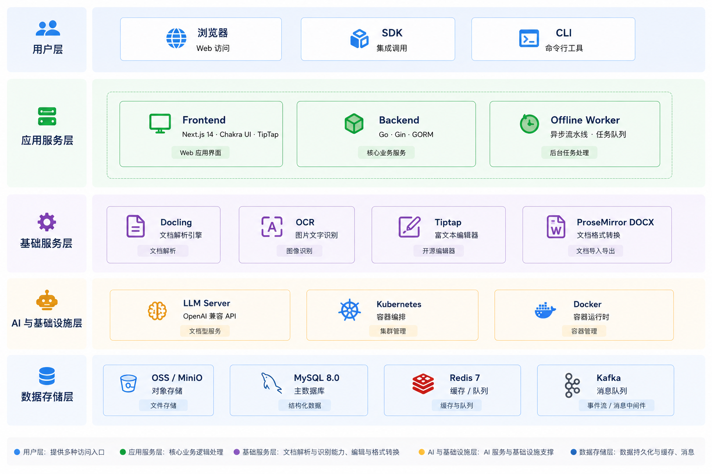

# 标擎 (BidEngine) — 智能投标助手

> AI 驱动的招投标智能化管理平台 · 解析 · 生成 · 审核 · 知识沉淀

[](https://go.dev/)
[](https://nextjs.org/)
[](https://chakra-ui.com/)
[](https://redis.io/)
[](https://mysql.com/)
[](./LICENSE)

---

## 产品定位

标擎（BidEngine）是面向招投标行业的企业级工作台，将**招标解析**、**标书撰写**、**合规审核**、**素材沉淀**融为一体化流程。通过 AI 大模型驱动的多阶段异步流水线，把传统手工劳动转化为可复用、可追溯、可协作的结构化交付。

**核心价值**：把"写标"变成"组装与校验"，让团队精力集中在差异化内容与关键合规点上。

---

## 核心功能

### 📄 招标解析（V2）

上传招标文件（PDF/DOC/DOCX），AI 自动进行章节识别、核心字段提取、条款分析、风险评估、标书蓝图生成及智能摘要，全流程结构化输出。

- **7 阶段异步流水线**：章节识别 → 核心字段提取 → 条款分析 → 投标评估（风险+评分） → 标书蓝图生成 → 智能摘要 → 完成
- **智能章节识别**：自动划分投标人须知、评标办法、资格要求、技术规范、商务条款、合同条款等章节，标注页码范围与摘要
- **核心字段提取**：LLM 驱动的双模抽取（预定义字段 + 动态发现行业特有字段），覆盖 20+ 字段类型，支持用户自定义关注点
- **条款级分析**：逐章节提取关键条款，按重要性（高/中/低）分级，精确溯源到原文页码
- **投标评估**：并发执行风险分析 + 评分预估，输出风险清单与各维度得分策略
- **标书蓝图**：AI 自动生成投标书大纲骨架，支持手动编辑节点
- **智能摘要**：综合招标原文 + 风险评估 + 企业资质库，一键生成投标可行性报告（含资格差距分析、关键风险、评分权重、关键日期）
- **终审确认**：章节确认 → 蓝图预览 → 终审，一键创建标书生成项目
- **断点续跑**：失败后可从失败阶段精准重试，无需从头开始
- **轮询进度**：前端 5 秒轮询，阶段 + 百分比双维度进度追踪

### ✍️ 标书生成

基于招标解析结果 + 素材库内容，AI 辅助生成投标书正文。

- AI 生成目录 + 逐章节 SSE 流式实时生成
- 素材库联动，自动匹配公司资质、业绩、方案段落并标注引用
- TipTap 富文本在线编辑，导出 DOCX/PDF

### ✅ 合规审核

上传招/投标文件，AI 自动对比差异，输出审核清单。

- 逐页 PDF 解析 + LLM 差异识别（类型、章节、建议）
- 溯源索引：精确定位差异在 PDF 中的页码和坐标
- 审核结果 Excel 导出，7 阶段进度追踪

### 📚 素材库 / 知识库

企业资质、业绩、方案、图片的结构化管理与 AI 增强。

- 按类型分类管理（资质/业绩/方案/模板/图片）
- AI 自动打标签 + 图片智能描述 + OCR 解析
- 标书生成时自动复用并标注来源

---

## 技术架构


### 技术选型

| 层级 | 技术 |
|------|------|
| 前端框架 | Next.js 14 (App Router) |
| UI 组件库 | Chakra UI v2.8 |
| 富文本编辑器 | TipTap v3 (ProseMirror) |
| 后端语言 | Go ≥ 1.23 |
| HTTP 框架 | Gin v1.9 |
| ORM | GORM v1.24 (gorm.io/gen 代码生成) |
| 数据库 | MySQL 8.0 |
| 缓存 / 队列 | Redis 7 |
| 对象存储 | MinIO（本地）/ 腾讯云 COS（可切换） |
| 文档解析 | Docling (ghcr.io/docling-project/docling-serve) |
| 招标情报采集 | 独立服务 tender-collection（Python + FastAPI + Playwright） |
| 认证 | JWT (Cookie: bid-engine-authorization) |
| LLM | OpenAI 兼容 API (DeepSeek / OpenRouter 等) |

---

## 快速开始

### 环境

- Go ≥ 1.23 / Node.js ≥ 22 / Docker Desktop
- MySQL 8.0（root:root，库 `smart-bid`）
- Redis 7 + Docling + MinIO（Docker 容器，通过 `docker compose` 管理）

### 环境相关配置（可选覆盖）

仓库里的 `bid-engine-backend/conf/conf-local.yml`、`conf-container.yml` 只包含通用默认值，
不含内网地址、自定义域名等服务端私有信息。部署时按需创建同目录下的覆盖文件，加载时自动深合并（覆盖优先）：

| 主配置 | 覆盖文件 |
|---|---|
| `conf-local.yml` | `conf-local.override.yml` |
| `conf-container.yml`（容器内为 `conf.yml`） | `conf-container.override.yml`（容器内为 `conf.override.yml`） |

覆盖文件已在 `.gitignore` 中，不会随仓库分发；也可以直接用环境变量
`BID_ENGINE_CONF_OVERRIDE_FILE` 指定其他路径。典型内容：

```yaml
properties:
  cors_allowed_domains: example.com      # 允许的跨域来源后缀，逗号分隔；留空表示只允许本地联调
  pdf_base_url: http://127.0.0.1:5001    # 私有 PDF 服务地址（可选，未部署时相关能力不可用）
  pdf_app_id: your_app_id
  pdf_app_secret: your_app_secret
```

容器模式请同时保留 `docker-compose-backend.yaml` 中的覆盖文件挂载（文件不存在时自动忽略）。

### 一键启动

```bash
bash start.sh
```

**自动执行：** 环境预检（只读检查 Go / Node / MySQL 可达性、基础容器运行状态）→ 释放宿主机 3000 / 1022 端口 → 配置前端环境变量 → 启动 Go 后端(1022) → 启动 Next.js 前端(3000) → 打开浏览器。脚本**不管理任何容器**（Redis / MinIO / Docling 仅检查并提醒，需自行用 `docker compose up -d` 维护）。

| 特性 | 说明 |
|------|------|
| 运行环境 | Bash（macOS / Windows Git Bash / WSL） |
| 依赖要求 | MySQL + Go + Node.js（基础容器需自行运行） |
| 进程管理 | 统一进程组，`Ctrl+C` 停止前后端（Docker 容器保持运行） |
| 自动清理 | 启动前 kill 占用 1022/3000 端口的旧进程 |
| 环境注入 | 自动写入 `.env.development.local` 指向本地后端 |
| 容器策略 | 不启动/停止/重建任何容器；仅检查 Redis / MinIO / Docling 状态并提醒 |
| 浏览器 | 自动打开 Chrome → `localhost:3000/signin` |

### 手动启动

```bash
# 1. Docker 基础服务
docker compose up -d

# 2. 后端
cd bid-engine-backend
LOCAL_DEV=true GOFLAGS=-mod=mod go run cmd/server/main.go

# 3. 前端
cd bid-engine-frontend
npm install --legacy-peer-deps
npm run dev:local
```

访问 `http://localhost:3000/signin` | 测试账号 `10000000000 / admin000000!`

### 本地服务

| 服务 | 端口 | 说明 |
|------|------|------|
| 后端 API | 1022 | Go Gin |
| 前端 Dev | 3000 | Next.js HMR |
| MySQL | 3306 | root/root |
| Redis | 6379 | Docker 容器 |
| Docling | 5002 | Docker 容器，文档解析（PDF 转结构化数据） |
| Doc-Converter | 5010 | Docker 容器，doc/docx → PDF |
| 招标情报采集 | 5011 | Docker 容器 `tender-intel-collector`，招标公告采集（站点 → 规范文档） |
| MinIO | 9000 | 本地对象存储 API |
| MinIO Console | 9001 | MinIO Web 管理控制台 |

### 容器部署（手动维护）

容器镜像构建与容器更新由**用户手动执行**（本地开发用 `bash start.sh`，端口 3000/1022）：

```bash
# 1. 构建镜像（在项目根目录）
docker build -t bid-engine-backend:TAG -f bid-engine-backend/Dockerfile bid-engine-backend/
docker build -t bid-engine-frontend:TAG -f bid-engine-frontend/Dockerfile bid-engine-frontend/

# 2. 一键启动/更新容器
bash docker-start.sh TAG            # 前后端同一 tag
bash docker-start.sh BE_TAG FE_TAG  # 分别指定 tag
```

| 服务 | 端口 | 说明 |
|------|------|------|
| 前端 | 8080 | 浏览器访问 http://localhost:8080 |
| 后端 | 8081 | 容器内部/宿主均为 8081（配置 `conf/conf-container.yml`） |

> 容器部署与本地一键启动端口完全错开（本地前端 3000 / 后端 1022），但两者共享 MySQL / Redis / MinIO，**不要同时运行两套前后端**。

---

## 项目结构

```
bid-engine/
├── start.sh                     # 一键启动脚本
├── docker-compose.yml           # Redis + Docling + Doc-Converter + MinIO + 招标情报采集 容器编排
├── tender-collection/           # 招标情报采集服务（Python + FastAPI + Playwright，端口 5011）
├── bid-engine-backend/          # Go 后端（模块名 bid-engine）
│   ├── cmd/server/main.go       # 入口
│   ├── conf/conf-local.yml      # 本地配置（http_port=1022）
│   ├── conf/conf-container.yml  # 容器配置（http_port=8081，挂载为 /service/conf/conf.yml）
│   └── pkg/
│       ├── handler/             # HTTP 处理器（按业务模块分组）
│       │   ├── bidanalysis/     # 招标解析 V2（7 阶段流水线）
│       │   ├── bidhub/          # 招标解析 V1 / 标书生成 / 合规审核
│       │   ├── material/        # 素材库管理
│       │   ├── tiptap/          # TipTap 编辑器辅助
│       │   ├── feedback/        # 用户反馈
│       │   ├── admin/           # 后台管理
│       │   ├── open/            # 开放 API
│       │   └── user/            # 用户认证
│       ├── middleware/          # JWT Auth / SSE / 日志
│       ├── router/              # 路由注册
│       ├── repo/                # 数据仓库层
│       │   ├── bidanalysisv3/   # 招标解析 V3 数据访问（运行态/文档索引/字段/证据/删除出箱）
│       │   ├── bid/             # 标书生成数据访问
│       │   ├── llm/             # LLM 客户端（OpenAI 兼容）
│       │   ├── docling/         # Docling 文档解析客户端
│       │   ├── material/        # 素材库数据访问
│       │   ├── oss/             # COS/MinIO 对象存储
│       │   └── redis/           # Redis 客户端
│       ├── entity/              # 数据模型 / 上下文工具
│       ├── config/              # 配置读取
│       ├── logic/               # 业务逻辑
│       ├── db/model/            # GORM 模型（gorm.io/gen 生成）
│       └── script/              # 定时任务
├── bid-engine-frontend/         # Next.js 前端
│   ├── app/
│   │   ├── (main)/              # 认证后页面
│   │   │   ├── page.tsx         # Dashboard
│   │   │   ├── bid-analysis/    # 招标解析 V3（深海智能工作台列表 + 核验详情）
│   │   │   ├── file-gen/        # 标书生成
│   │   │   ├── file-audit/      # 合规审核
│   │   │   └── material/        # 素材库
│   │   ├── (auth)/              # 登录 / 注册
│   │   └── api/[...path]/       # API 代理 → 后端
│   ├── components/
│   │   ├── analysis/            # 招标解析组件
│   │   │   ├── bid-analysis-v3/ # V3 工作台组件（状态轨/证据导航/多值字段/结构化表格）
│   │   │   └── tender-summary/  # 智能摘要组件
│   │   ├── common-editor/       # TipTap 富文本编辑器
│   │   ├── gen/                 # 标书生成
│   │   ├── common/              # 通用组件（表格/分页/列配置）
│   │   └── layout/              # 布局（Header/Sidebar）
│   ├── service/                 # API 请求 hooks
│   ├── hooks/                   # 自定义 hooks
│   ├── contexts/                # React Context
│   └── theme/                   # Chakra UI 主题
├── docs/                        # 项目文档
├── AGENTS.md / CLAUDE.md        # 开发规范
└── README.md                    # 本文件
```

---

## 开发规范

- **分支**：`dev`（开发）/ `main`（生产）
- **Commit**：`type: 中文描述`（feat/fix/docs/refactor/chore/design），3+ 文件须拆分
- **后端**：`LOCAL_DEV=true` 仅本地使用，import 统一 `bid-engine/` 前缀
- **前端**：React Hooks 组件须 `"use client"`，`npm install --legacy-peer-deps`
- **设计**：以资深产品经理视角审视每个功能点的阶段感知、失败反馈、重试机制、状态闭环

---

## 许可与使用范围

本项目采用 **PolyForm Noncommercial License 1.0.0**，属于源码公开（source-available），**不是** OSI 定义的开源许可。

| 场景 | 是否允许 |
|---|---|
| 个人学习、研究、实验、私有部署、二次开发 | 允许 |
| 慈善组织、教育机构、公共研究组织、公共安全或健康组织、环保组织、政府机构的非商业使用 | 允许 |
| 在 main 基础上 Fork、修改、提 PR 参与共建 | 允许 |
| 对外提供收费服务、集成进商业产品、企业内部经营性使用 | 禁止，需另行取得书面授权 |

完整条款见 [LICENSE](./LICENSE)，名称与 Logo 的授权范围见 [NOTICE](./NOTICE)，参与贡献的条款见 [CONTRIBUTING.md](./CONTRIBUTING.md)，安全问题请按 [SECURITY.md](./SECURITY.md) 报告。

**免责声明**：本软件按“现状”提供，不附带任何明示或默示担保。AI 生成的招标解析、合规审核与标书文本仅供参考，不构成法律、合规或专业建议，使用前请自行核验。
